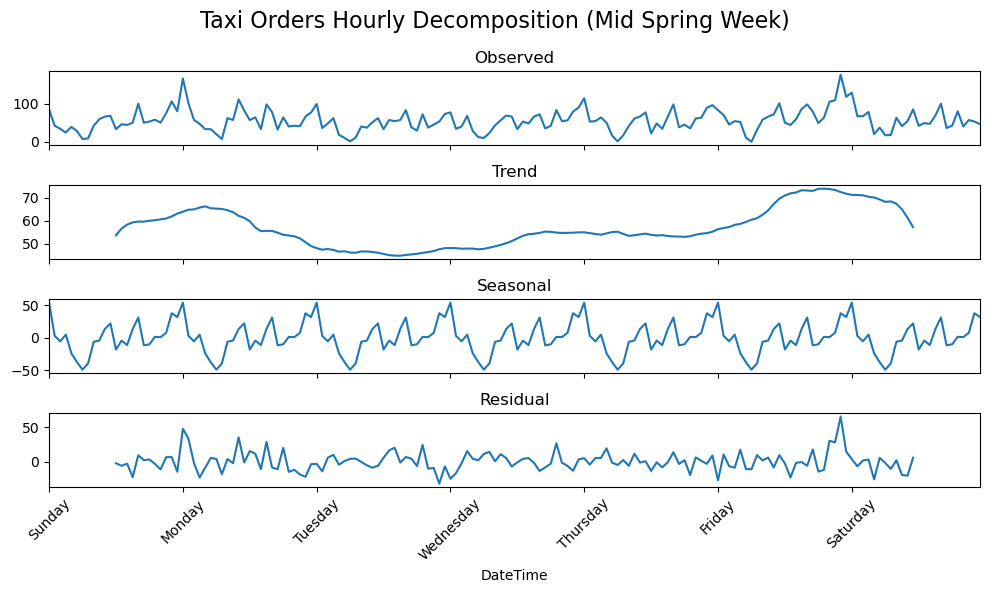
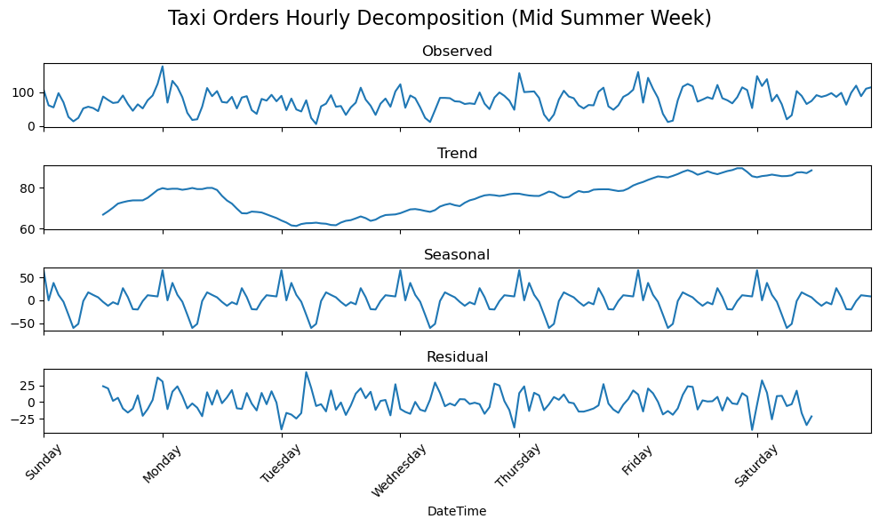
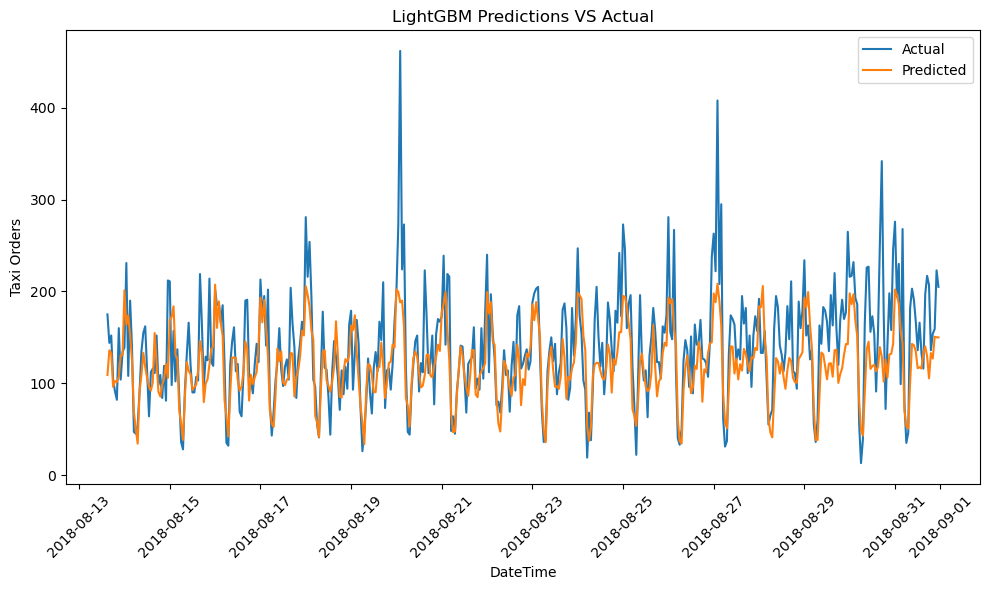
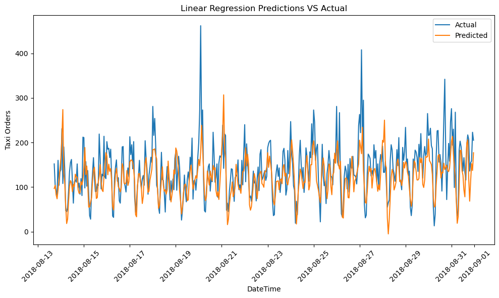

# Forecasting Hourly Taxi Orders Using Machine Learning

## Introduction

The goal of this project is to develop a predictive model to forecast the number of taxi orders at airports for the next hour. By accurately predicting demand, the Sweet Lift Taxi company aims to attract more drivers during peak hours, thereby improving service efficiency and customer satisfaction. This project involves:

- Analyzing historical data on taxi orders.
- Resampling the data to hourly intervals.
- Training various machine learning models with different hyperparameters.
- Evaluating their performance using the Root Mean Squared Error (RMSE) metric.

**Benchmark:** The final model's RMSE on the test set should not exceed 48.

[Notebook](/forecasting_hourly_taxi_orders.ipynb)

## Dataset Description

The dataset used in this project is provided by Sweet Lift Taxi company and contains historical data on taxi orders at airports. The data is stored in `data/taxi.csv` and includes the following key features:

- `datetime`: Timestamp of the order.
- `num_orders`: Number of taxi orders at the given timestamp.


## Data Preprocessing

The data preprocessing steps include:

1. **Loading the Data**: Reading the data from the CSV file.
2. **Resampling**: Aggregating the data to hourly intervals to match the prediction requirements.

## Exploratory Data Analysis

In this section, we analyze the historical taxi order data to uncover patterns and insights that will inform the modeling process. Key findings from the exploratory data analysis include:

1. An overall rising trend in taxi orders as time goes on, particularly in the summer months, revealed more clearly with a 24 hour rolling mean.  
    

2. Hourly seasonality with midnight as the busiest time and a sharp decline in the early morning before picking up again in the evening.  

    <div style="display: flex; justify-content: space-around;">
    
    
    </div>  
    <br>
    
    This pattern can be more clearly explored by plotting the average taxi orders per hour on a bar graph.  
    
      

3. Weekly seasonality, with two peaks per week on Mondays and Fridays is revealed when resampling the data to daily totals.  

      

## Modeling

In this section, we focus on developing predictive models to forecast the number of taxi orders. Various machine learning models were trained and evaluated to identify the best performing model. The models and approaches used were:

1. **Using Previous Hour's Order Demand as Prediction - Baseline model**
    - A baseline model to establish a reference for more complex models.
    - Simply predicts the previous hour's orders as the `num_orders` value for the next hour.

2. **Linear Regression**:
   - Another baseline model to establish a reference for more complex models.
   - Simple and interpretable but may not capture complex patterns in the data.
   - Proved to be more effective than expected.

3. **Random Forest Regressor**:
   - An ensemble learning method that combines multiple decision trees.
   - Tends to perform well on a variety of datasets due to its ability to capture non-linear relationships.

4. **LightGBM (Light Gradient Boosting Machine)**:
   - A gradient boosting framework that is highly efficient and scalable.
   - Often achieves state-of-the-art results on structured datasets.

5. **SARIMA (Seasonal Autoregressive Integrated Moving Average)**:
   - Determined by the auto_arima method
   - A time series forecasting method that accounts for seasonality.
   - Suitable for data with clear seasonal patterns.

### Hyperparameter Tuning

Grid search and time series cross-validation were employed to tune the hyperparameters of Random Forrest and LightGMB models. Grid search testing for the best lag and rolling mean features was also conducted for the Linear Regression, Random Forrest, and LightGMB models.

 The models were trained and validated using an 80-10-10 train-validation-test split, and the best performing models were evaluated on the test set.

## Model Evaluation

The performance of the models was evaluated using the Root Mean Squared Error (RMSE) metric. The results are as follows:

| Model              | Description        | Best Validation Score | Best Lag | Best Rolling Mean |
|--------------------|--------------------|-----------------------|----------|-------------------|
| lgbm_results       | LightGBM           | 30.897096             | 8        | 12                |
| rf_results         | Random Forest      | 31.703193             | 14       | 24                |
| lr_results         | Linear Regression  | 33.895838             | 34       | 8                 |
| arima_results      | SARIMAX            | 44.816184             | 36       | 24                |
| pred_prev_results  | Predict Previous   | 47.246346             | 0        | 0                 |
| ar_results         | AutoRegressive     | 76.525365             | 0        | 0                 |

  

The absolute best performing model according to RMSE score was the LightGBM model, followed closely by the random forrest model. This exemplifies the benefits of gradient boosting.  

The AutoRegressive model performed the worst, nowhere near good enough for the standard set by Sweet Lift.

The auto_arima method was able to find a model (SARIMAX) that performed significantly better than the AutoRegressive model, but still only a little better than our baseline model that predicts known previous values.

The Linear regression was still competitive with the LightGBM model, and its simplicity may make it a better choice for Sweet Lift. As such, the LightGMB model and Linear Regression model were tested on the test set and evaluated on their RMSE scores, training time, and prediction time.

### LightGBM Vs Linear Regression

| Model               | Test Score          | Training Time (s)      | Prediction Time (s)    |
|---------------------|---------------------|------------------------|------------------------|
| LightGBM            | 44.26391031217571   | 0.07456111907958984    | 0.001577138900756836   |
| Linear Regression   | 47.925617295136206  | 0.007214784622192383   | 0.0016591548919677734  |

  
    <div style="display: flex; justify-content: space-around;">
    
    
    </div>

Although the Linear Regression model does train in about a third of a second faster than the LightGBM model, it has a higher RMSE (3.66 higher) and actually takes slightly longer (.0005 seconds) to calculate predictions.

## Conclusion

The LightGBM model demonstrated significantly better performance on the test set compared to other models, with only a slight increase in computation time. Given its superior accuracy, Sweet Lift should consider implementing the LightGBM model to predict the number of taxi orders for the next hour.

To effectively utilize this model, the following steps are recommended:

1. Apply the `make_features(data, datalags=16, rolling_mean=4)` function to preprocess the time series data.

2. Define the model with the specified parameters: 
   ```python
   model = LGBMRegressor(learning_rate=0.3, max_depth=10, n_estimators=15)
